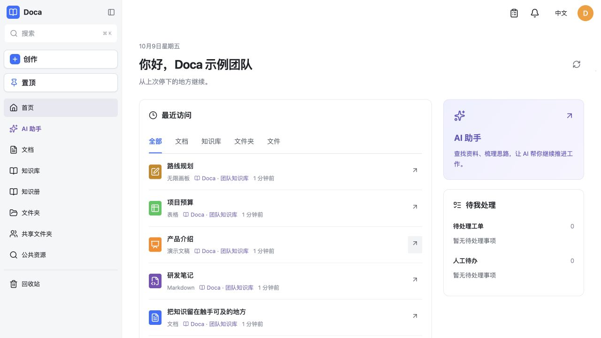
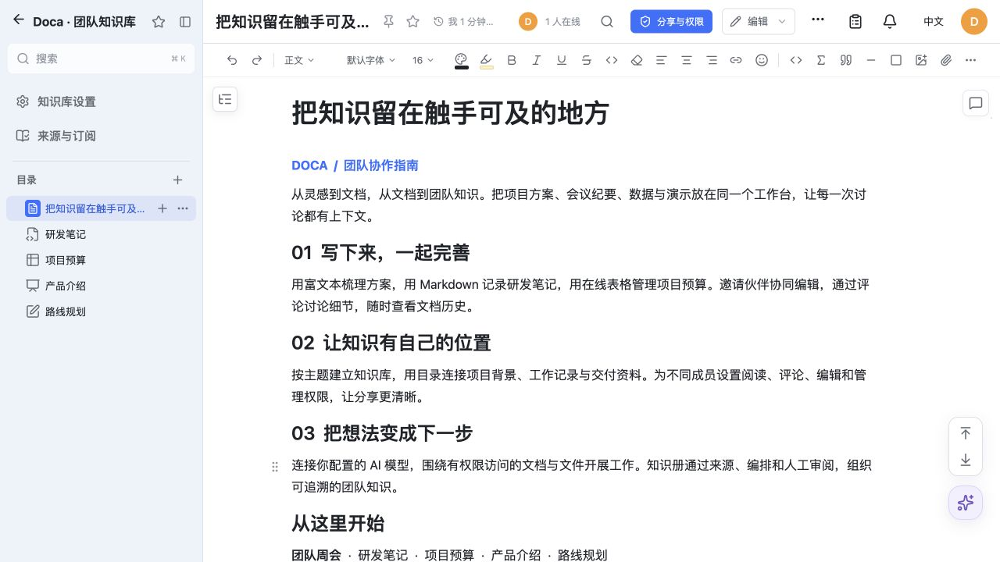
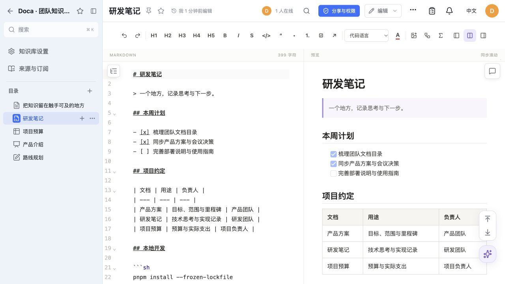
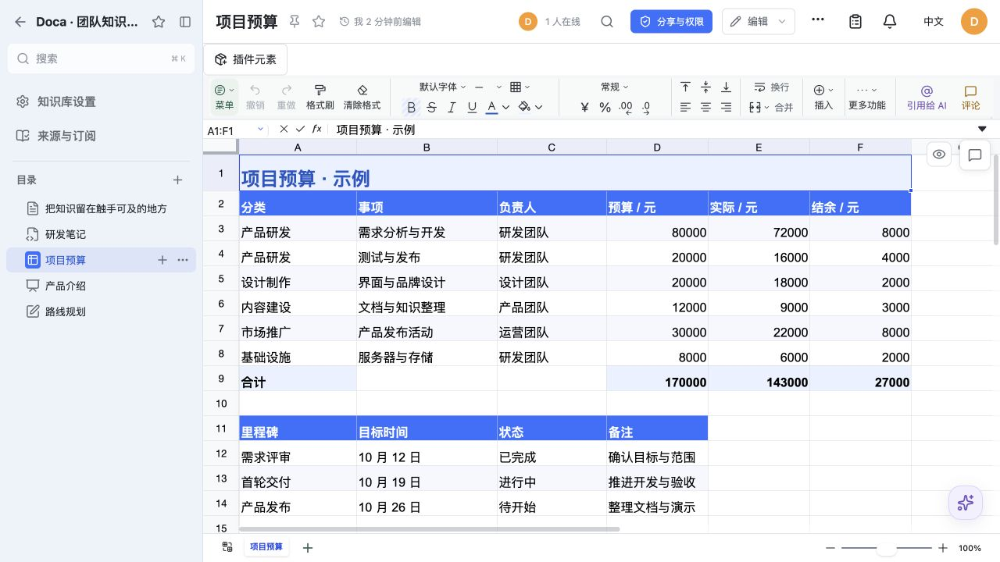
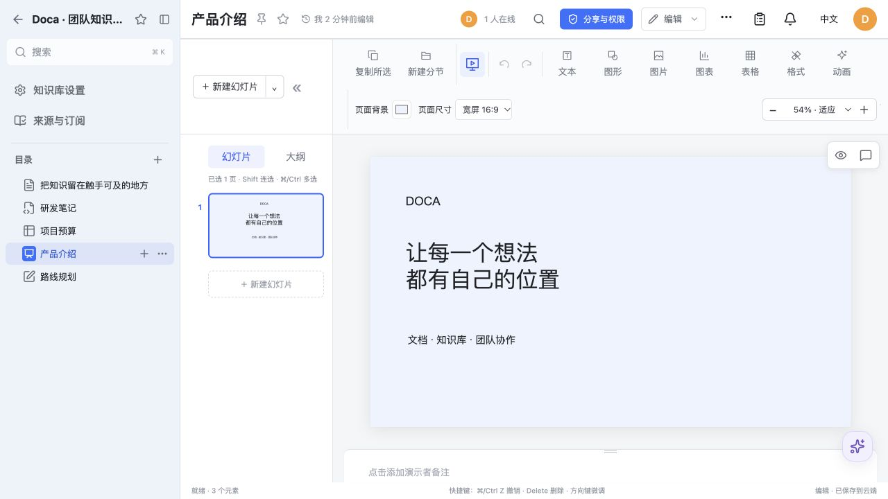
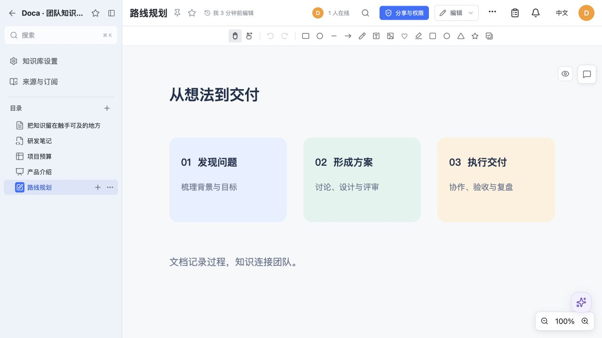

<p align="center">
  <a href="https://d.smartdoca.cc"></a>
</p>

<h1 align="center">Doca</h1>

<p align="center">
  <b>Your documents. Your knowledge. Your workspace.</b><br>
  Open-source document management, a knowledge base, and real-time collaborative editing<br>
  for individuals and small teams. Self-hosted, with a personal AI assistant.
</p>

<p align="center">
  <a href="https://github.com/smartdoca/doca/releases"></a>
  <a href="LICENSE"></a>
  <a href="#quick-start-with-docker"></a>
  
</p>

<p align="center">
  <a href="https://d.smartdoca.cc"><b>Try the live demo →</b></a> &nbsp;·&nbsp;
  <a href="https://smartdoca.github.io/doca/#/en/">Documentation</a> &nbsp;·&nbsp;
  <a href="https://store.smartdoca.cc">Plugin marketplace</a> &nbsp;·&nbsp;
  <a href="#quick-start-with-docker">Self-host Doca</a>
</p>

<p align="center"><a href="README.md">简体中文</a> · English</p>



<p align="center"><sub>Pick up where you left off. Documents, team knowledge, and your AI assistant in one workspace.</sub></p>

> [!NOTE]
> The [live demo](https://d.smartdoca.cc) is for exploration. Demo data is cleared from time to time; please do not store important data there.

## Make room for your next idea

| Write and collaborate | Build a shared memory | Make it your own |
| --- | --- | --- |
| Draft a proposal, track a budget, or sketch a plan. Invite collaborators and discuss details in comments. | Organize documents into knowledge libraries. Build knowledge books with source evidence, workflows, and human review. | Deploy on your own server. Connect your AI models and extend the workspace with business plugins. |

## See Doca in action

### Documents that bring the team together

Rich text for plans and meeting notes, with a library tree, formatting tools, permissions, and document history close at hand.



### Five formats, one workspace

<table>
  <tr>
    <td width="50%"><br><b>Markdown</b> — notes, code, and structured writing.</td>
    <td width="50%"><br><b>Spreadsheets</b> — budgets, data, and project tracking.</td>
  </tr>
  <tr>
    <td width="50%"><br><b>Slides</b> — present ideas and project updates.</td>
    <td width="50%"><br><b>Canvas</b> — map out a process on an infinite board.</td>
  </tr>
</table>

<p align="center"><sub>Actual Doca UI, captured with sample content in an isolated local deployment.</sub></p>

## What you can do

| Capability | What it brings to your workspace |
| --- | --- |
| **Online documents and collaboration** | Rich text, Markdown, spreadsheets, slides, and canvas; realtime collaboration, comments, and history. |
| **Knowledge management** | Knowledge libraries with document trees, plus shared knowledge books with workflows, source evidence, and human review. |
| **Personal AI assistant** | Work with authorized documents and files, read PDF/Office attachments, generate or edit images, and prepare browser drafts. Requires configured models and services. |
| **Files and sharing** | Personal files, shared folders, invitations, permission controls, share links, search, notifications, and trash. Local or S3-compatible file storage. |
| **Accounts and languages** | Password, OIDC, Google, GitHub, WeChat QR, and QQ sign-in; Chinese and English interfaces. External login requires service configuration. |
| **Self-hosting and extensions** | Docker deployment; SQLite for one server, or shared PostgreSQL, Redis, and file storage for multiple replicas. Business plugins use the public `@smartdoca/plugin-sdk`. |

One deployment has one account system. The default image installs no quick-notes, mail, calendar, membership, or moderation plugins. Templates and materials need a separately installed provider. See [capabilities and limits](https://smartdoca.github.io/doca/#/en/getting-started/features).

## Useful links

| Destination | Address |
| --- | --- |
| **Live demo** | [d.smartdoca.cc](https://d.smartdoca.cc) |
| **Documentation** | [smartdoca.github.io/doca](https://smartdoca.github.io/doca/#/en/) |
| **Plugin marketplace** | [store.smartdoca.cc](https://store.smartdoca.cc) |
| **Source code** | [github.com/smartdoca/doca](https://github.com/smartdoca/doca) |
| **Releases** | [Download and release notes](https://github.com/smartdoca/doca/releases) |
| **Feedback** | [Report an issue or request a feature](https://github.com/smartdoca/doca/issues) |

## Quick start with Docker

Requires Git, Docker Engine, Docker Compose, and an HTTP(S) origin served by a reverse proxy. This installs the published 0.1.16 image into a fresh database. Existing installations must read the [release requirements](https://smartdoca.github.io/doca/#/en/releases/0.1.16) and preserve their data before changing versions.

```sh
# 1. Clone the matching release
git clone --branch v0.1.16 --depth 1 https://github.com/smartdoca/doca.git
cd doca

# 2. Configure the environment
cp docker.env.example .env
# Edit .env: set DOCA_ORIGIN to your HTTP(S) origin.
# Keep the example local file-store configuration for a single server.

# 3. Pull the image
docker compose pull

# 4. Start and check health
docker compose up -d
docker compose ps
# Wait for healthy before initializing the administrator

# 5. Initialize the administrator login and password
bash scripts/bootstrap-admin.sh
```

The password must be at least 12 characters. There is no default account. Compose binds to `127.0.0.1:39120`; configure an HTTP(S) reverse proxy before browser access. SQLite, files, plugins, and the AI database persist in `doca_data`.

The [complete quick start](https://smartdoca.github.io/doca/#/en/getting-started/quickstart) includes `.env`, the reverse proxy, health checks, administrator recovery, and data preservation.

## Development

Node.js 22.12 or newer and pnpm 11.25.0:

```sh
pnpm install --frozen-lockfile
cp .env.example .env
# Set the storage root in .env to an absolute writable local directory.
pnpm dev
```

Open `http://127.0.0.1:39130`. Initialize the administrator with `bash scripts/bootstrap-admin-local.sh`. `pnpm check` runs TypeScript, tests, and the Web build. See [development](https://smartdoca.github.io/doca/#/en/development/development).

## Documentation

- [User guide](https://smartdoca.github.io/doca/#/en/getting-started/user-guide)
- [Deployment and configuration](https://smartdoca.github.io/doca/#/en/operations/deployment)
- [Plugin development](https://smartdoca.github.io/doca/#/en/plugins/plugin-development)
- [HTTP API](https://smartdoca.github.io/doca/#/en/reference/api); the running application also provides `/api/openapi.json`.
- [Release notes](https://smartdoca.github.io/doca/#/en/releases/0.1.16)
- [Documentation source](docs/README.md)

For a documentation preview, run `pnpm docs:dev` and open `http://127.0.0.1:39140/#/en/`. `pnpm docs:check` verifies bilingual coverage and local links. GitHub Pages setup is in [documentation maintenance](docs/documentation.md).

## License

[MIT](LICENSE). The separately published rich text, spreadsheet, Markdown, canvas, and slides editors use the same license.
