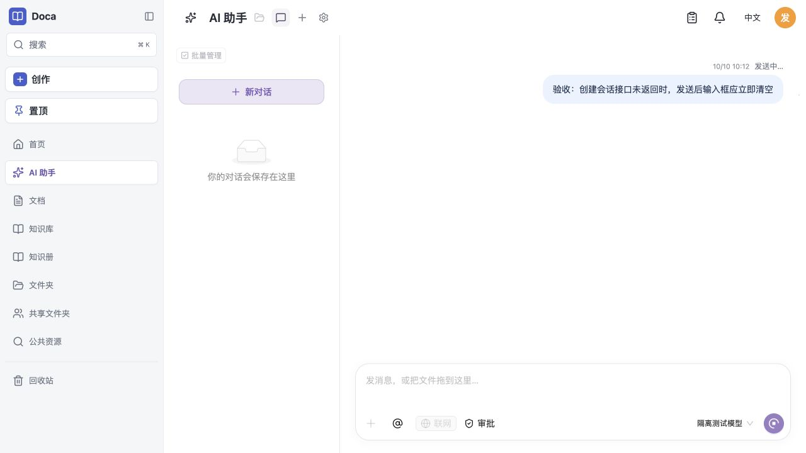
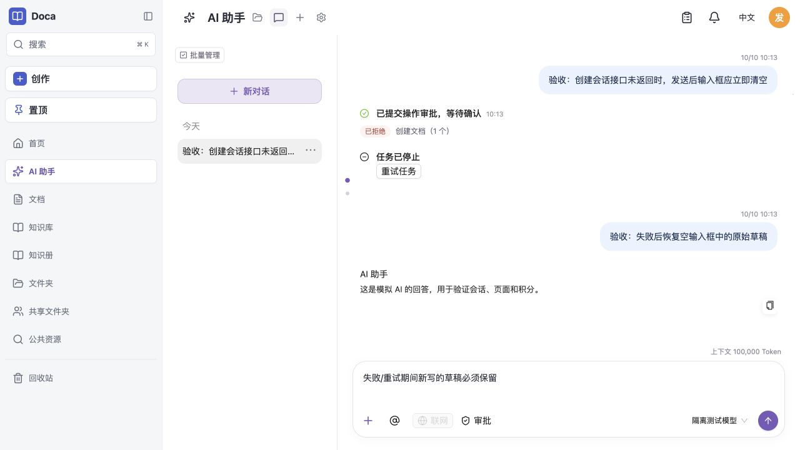
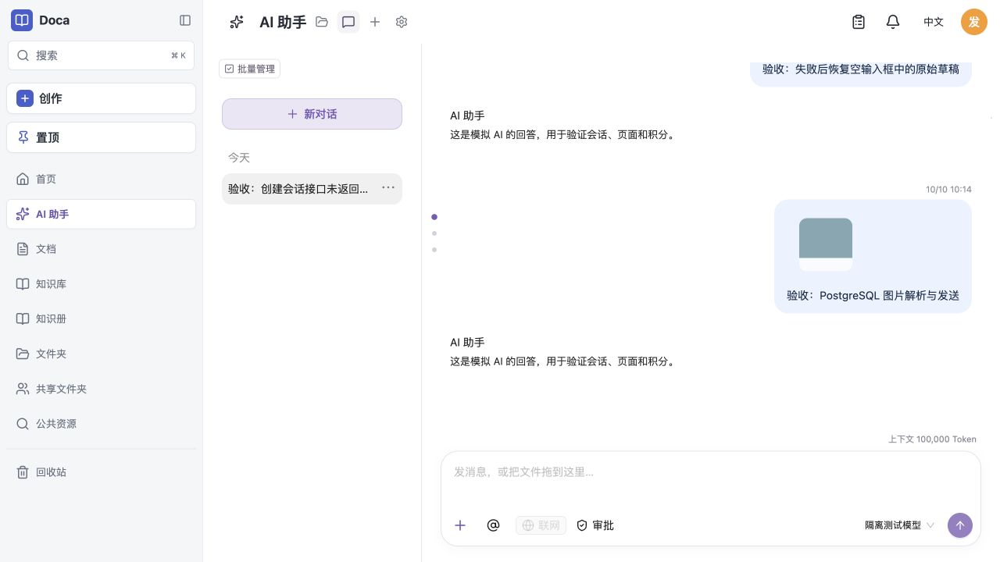

# PostgreSQL 附件与发送交互验收 · 2026-10-10

## 环境与范围

使用独立 PostgreSQL 17 容器、随机测试 schema、临时文件存储和测试账户。浏览器访问隔离反向代理，主动挂起会话创建、附件上传与消息提交，或对一条提交注入 503。模型为本地可控 mock，无真实模型费用。没有修改用户文档、生产数据库或生产部署。

## 根因与修复

`file_storage_objects.size` 和 `file_derivatives.size` 是 bigint，PostgreSQL 驱动将其返回为字符串。直接用 `Buffer.length !== row.size` 比较会错误拒绝完整文件。修复在读取边界转换并核验安全整数，保持大小检查、存储元数据和已有协议不变。PDF 原稿、参考图片及已保存图片的同类核验一并修正。

`waitFileExtract` 原先立即读到上一条 failed 缓存，先于重试 worker 更新 pending；现在等待当前任务完成后才返回失败，并复用同一对象的后台提取。

发送代码原先在创建会话、上传和提交消息之后清空。现在保存发送快照并同步清空，响应不再修改当前输入框。失败时仅恢复到空输入框，保留较新的草稿；重试沿用原请求 ID 和已上传文件。

## 浏览器验证

| 场景 | 结果 |
| --- | --- |
| 创建会话接口挂起，点击发送 | 气泡显示发送中，输入框立即为空 |
| 挂起期间输入下一条，再释放创建和提交 | 下一条草稿完整保留 |
| 503 且输入框为空 | 保留失败气泡，恢复原稿 |
| 点击失败气泡重新发送 | 恢复的原稿立即清空；请求 ID 不变 |
| 重试期间输入新草稿，再注入 503 | 新草稿不被覆盖 |
| 再次重试成功 | 新草稿仍保留；没有重复气泡 |
| PNG 上传挂起，点击发送 | 文字和附件立即移入气泡，显示上传进度 |
| 释放 PNG 上传 | PostgreSQL 提取 ready，图片内容进入视觉请求，任务完成 |

一个失败消息的三次请求均使用同一 ID；图片只出现一次上传请求。截图显示的是模拟模型，不作为图片语义描述质量证明。

## 自动验证

- PostgreSQL：`tests/ai-file-extract-size.test.ts` 与 `tests/ai-attachments.test.ts`，21 项通过。新用例明确断言原始 bigint 是字符串，验证完整图片、真正短文件、失败后重新解析及原存储元数据不变。
- 扩大 PostgreSQL 验证：`ai-image-scene-analysis`、`ai-image-mask-segment`、`ai-image-saved-revision`，100 项通过，19 项因既有字段容量问题失败。具体原因：`assets.purpose varchar(16)` 无法存入 `ai_image_candidate`；该列扩容需要单独同意，未改 schema 或绕过验证。
- 首轮全量测试并发负载导致超时，已停止该轮；完成后的限制并发全量结果记录于下方，未将中断轮计为通过。
- 限制并发全量回归：`pnpm exec vitest run --maxWorkers 4`，265 个文件通过，2,589 项通过、3 项环境测试跳过，287.17 秒。
- TypeScript 与 Web 生产构建通过；54 页双语文档检查通过。

数据库基线、parser version 4、draft version 1 均未改变。旧协议处理和已有数据未转换；并未通过删除或重置数据规避错误。
