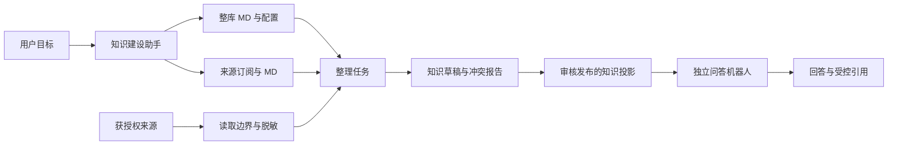

# 知识体系：定义、订阅、整理与独立问答

更新：2026-09-25。状态：首批实现及测试已落地，本文仍包含后续目标。以第 12 节的实现表区分已实现与拟议能力；前文中的完整 schema、SDK 和工具名称不等于均已导出。

## 1. 核心模型

一个知识库拥有一份整体定义 `KNOWLEDGE.md`、若干来源订阅、整理产出的知识文档和可供问答检索的发布版本。每条订阅可以附带 `SOURCE.md`。定义文件是带稳定 ID、版本、修改历史与管理权限的管理资产，不混入普通问答语料。

整库 MD 就是这个知识库的整理专用 skill，声明“形成什么知识、如何组织、如何判断与维护”；来源 MD 是针对特定材料的补充指引。订单去重、统计口径、来源权威、权重、冲突处理、总结详略等业务规则均由 MD 声明，AI 读取后结合通用工具执行，不能变成系统内置的订单/财务专用逻辑或必须填写的固定业务表单。

订阅资源、连接、调度、权限、禁读范围等运行约束由结构化配置和执行器保障。AI 可从用户要求和 MD 起草这些配置，但 MD 不能自行赋予权限。业务指引与运行约束一同版本化管理，职责不混淆。

建设助手帮助用户创建和维护；整理任务读取获授权来源并形成知识；独立问答机器人只检索获授权的知识发布版本。一个机器人可绑定多个知识库，三者不共享工具权限。

知识体系只持久化提炼后的独立知识成果、必要的结构化事实和来源追溯元数据，不把原始材料副本或原始分块索引作为问答后备库。原始文件、邮件和网页仍由各自系统保存，不回写来源；整理中的受控临时处理不等于知识库长期存储原文。手工编写的知识也属于独立成果，不强制关联外部来源。

**来源是建设材料，知识是独立资产。** 检索、重排、引用和回答只依赖已保存知识及其自身权限，不访问来源正文、不用来源 ACL 过滤既有成果，也不因来源失联而降低检索权重。即使全部来源删除或撤权，只要知识本身未变更、未被撤回，其可回答范围和答案质量不应因此下降；失去的是继续更新和打开来源的能力。

提炼幅度由整库/来源规则与任务目标决定，可从概览到详细知识条目。摘要必须保留回答所需的概念、限定条件、单位、有效时间、关联和事实，不能只存“详见来源”。未被提炼保存的细节原本就不属于知识库可回答范围；不能通过临时读来源掩盖总结不完整。发布前按目标问题验收，缺失细节应在整理阶段补充。

## 2. 调研与配置清单

以下采用官方产品资料与安全项目资料，用于识别设计缺项，不表示选用这些供应商。

- Azure AI Search 将文档权限贯穿索引与查询，支持把权限检查放在检索链路，而非只隐藏页面按钮；其部分连接器能力仍为预览。[文档级访问控制](https://learn.microsoft.com/en-us/azure/search/search-document-level-access-overview)
- Amazon Bedrock 的来源变更需要同步，并区分删除与保留索引数据；网页来源还有范围、排除与抓取上限。Doca 因此需要独立的同步、失联、删除和保留设置。[来源更新](https://docs.aws.amazon.com/bedrock/latest/userguide/kb-ds-update.html)、[网页来源](https://docs.aws.amazon.com/bedrock/latest/userguide/webcrawl-data-source-connector.html)
- Google Sensitive Data Protection 区分敏感信息检测与遮盖、删除、替换。Doca 应区分“不得读取”与“可受控处理但不得进入模型或发布内容”。[脱敏文档](https://docs.cloud.google.com/sensitive-data-protection/docs/deidentify-sensitive-data)
- OWASP 将外部文档中的恶意指令列为间接提示注入风险。来源只能作为资料，不能修改工具权限或安全配置。[提示注入](https://genai.owasp.org/llmrisk/llm01-prompt-injection/)
- Microsoft 的 RAG 设计覆盖分块、元数据与评估；定义应包含质量样例和更新后的回归检查。[设计与评估](https://learn.microsoft.com/fil-ph/azure/architecture/ai-ml/guide/rag/rag-solution-design-and-evaluation-guide)

以下是输入信息清单，不是十二组必须固化的业务表单。目标、目录、抽取方式、业务字段、去重、冲突、权重和回答要求主要写在专用 MD；连接、日程、权限和执行上限为系统配置。创建时只问目标、来源、受众与安全边界，其余由 AI 起草可编辑指引。

| 配置组 | 需要保存的信息 | 建议初始行为 |
| --- | --- | --- |
| 定义与责任 | 名称、目标、读者、负责人、语言、纳入/排除主题、术语 | AI 起草，负责人修改 |
| 知识结构 | 主题树、稳定节点 ID、实体类型、模板、命名、拆分粒度、交叉引用 | 按内容归类，保留人工节点 |
| 来源订阅 | 插件来源、连接引用、资源范围、递归、类型/路径/时间过滤、附件 | 仅选中范围，不自动扩展 |
| 来源解释 | 来源 MD、字段映射、部门、权威领域、权重、有效时间、示例 | 继承整库非安全默认值 |
| 安全与发布 | 禁读资源/字段、脱敏规则、允许输出字段、发布授权和受众 | 不自动扩大可见范围 |
| 解析与抽取 | 解析器、OCR、语言、分块、表格/实体 schema、去重键、证据 | 标题分块，保留单位和表格结构 |
| 冲突与可信度 | 领域权威来源、版本/有效期、权重、冲突动作、人工裁决 | 并列待确认，不静默覆盖 |
| 触发 | 手动、日程、时区、来源事件、来源级覆盖、暂停、补跑 | 手动可用，定时默认关闭 |
| 整理与发布 | 扫描、抽取、整理、审核、自动更新允许范围 | 默认先草稿再发布 |
| 生命周期 | 增量游标、来源状态、缺源处理决定、知识自身有效期、历史保留与回滚 | 来源撤权停止读取；成果保留，下次整理提示一次 |
| 检索与回答 | 范围、过滤、排序、引用、证据不足/冲突处理、结构化统计 | 只用当前获授权的已发布知识 |
| 运行与质量 | 技术预算、超时、批量、并发、重试、告警、审计、验收问答 | 有界执行，失败可见，不报假成功 |

技术预算指条数、时间、模型调用等运行上限；计费和会员额度继续由业务插件处理，宿主记录原始使用事实。

## 3. 整库定义与配置一致性

### MD 内容

`KNOWLEDGE.md` 至少包含目标与读者、范围、术语、目录、条目模板、实体/字段、来源使用原则、冲突处理、更新规则、回答要求、正反验收样例。它不是全部知识正文的合集。

保留一份整库主定义；内容较多时可显式引用本库受管理的专项指引，如 `guides/organization.md`、`guides/extraction.md`、`guides/conflicts.md`。它们与来源 SOURCE.md 共同构成专用 skill，不要求用户创建固定数量的文件。创建、修改和引用均走库管理权限，不从来源正文自动安装或更新 skill。

系统通用整理 skill 负责加载本库指引、调用工具、报告结果；本库 MD 决定领域行为。网络协议库和公司订单库使用相同工具，更换 MD 就应能改变归类、去重与冲突策略，无需修改宿主代码。

目录节点使用稳定 ID，改标题不生成重复节点。支持按主题、实体（客户/产品/项目）、来源或混合组织；来源和节点是多对多。整库与来源 MD 均支持读取、编辑、导入、导出与版本比较。

### 单一事实来源

持久化一个版本化配置记录，包含 `schemaVersion`、`revision`、主 MD、所引用指引的版本、运行配置与来源引用。导出 MD 可用 YAML front matter 表示运行配置，正文表示专用 skill。运行表单与 front matter 保持一致；业务规则以 MD 为唯一可编辑事实来源，不再维护另一套独立业务配置。

AI 可从 MD 生成本次任务的抽取 schema、匹配规则、计算计划和校验断言，但它们是带 MD 版本引用的派生产物，不是第二份规则。MD 更新后重新生成计划，不能运行过期计划。通用计算、去重、表格写入工具只执行经校验的计划，不理解硬编码的订单业务。无法理解或相互矛盾的指引应提出具体待决问题，不猜测后静默执行。

保存须 schema 校验并携带 `expectedRevision`，原子提交。未知执行字段、重复 YAML 键、非法枚举、不可执行的安全规则报错，不静默忽略。凭据仅保存服务端连接引用，不进入 MD、浏览器、提示词或导出；导入的资源/连接引用重新鉴权，不能导入授权。

“不要读取联系方式”是意图，实际效果来自规则和执行器。AI 将意图翻译成配置草稿，界面区分已执行规则和待配置说明。无法可靠执行的安全要求应阻止来源启用，不能只写进提示词便宣称安全。

### 继承与优先级

运行选项按“系统默认 → 整库 → 来源”覆盖，展示最终值及来源。业务指引先读主 MD，再加载显式引用的专项指引及相关来源 MD；来源指引中的禁止、排除和可输出范围优先，整库指引仅在这些边界内指导内容组织；无法同时满足的要求列为待处理。安全限制取交集：允许范围逐层收窄，禁止集合合并，禁止优先。来源不能关闭整库脱敏，权重不能影响权限。

来源正文、来源 MD 和模型输出不能修改安全配置。限制放宽必须是有权限操作者提交的显式变更，保存差异和审计；普通 MD 编辑不隐式放宽结构化限制。

### 来源归属与库内管理（确认后的权限规则）

- 来源创建者管理自己的来源 MD、范围、来源级安全配置，可以删除自己的订阅。
- 其他知识库管理员不能修改或删除他人的来源；知识库所有者可以删除他人来源，但也不能修改。
- 共同整理指引由知识库管理员正常维护，无需来源创建者再次批准。来源创建者必须在自己的 SOURCE.md 和来源安全配置中声明边界，不依赖共同指引提供隐私保护。共同指引不能放宽来源自身限制。
- 整理器逐来源读取和提炼：仅加载当前来源的 SOURCE.md 与共同指引，不将其他来源的 MD 和原始材料混入同次提炼。服务端以创建者当前有效身份检查读取权；停用或撤回管理/来源权限后停止读取。模型输出不能反向修改来源配置。
- 来源排除、精确文字替换、常见联系方式过滤是程序执行的限制；任意自然语言语义限制仍依赖模型理解和人工审核，不能宣称已提供可靠的任意字段识别能力。
- 知识库管理员在所有库内文档上具有管理权限下限，不受子文档自定义权限、拒绝记录、继承开关或“不含子级”的影响。普通成员仍遵循各文档权限。修改此规则不把管理员变成知识库所有者，也不改变其他管理员来源的归属。
- 旧来源没有可信创建者记录时不自动转交给库所有者，也不自动读取；历史知识保留。需要明确重建订阅或迁移来源归属。

## 4. 来源订阅与来源 MD

订阅保存稳定 ID、`ownerPlugin/sourceType`、来源资源 ID 或规范 URL、连接引用、维护授权、配置版本、独立增量游标与运行状态。通过公开来源注册接口扩展，避免继续增加邮件等宿主业务分支；缺失能力须版本化新增，不能假定现有接口已支持。

`SOURCE.md` 可为空并沿用整库规则；建议包含用途、权威范围、内容特点、字段/术语、抽取和排除示例、目录映射、冲突说明。它是订阅的管理资产，不自动进入知识索引。

| 来源 | 专属配置 |
| --- | --- |
| 文件夹 | 文件夹 ID、递归深度、包含/排除子目录、类型、大小、更新时间、附件 |
| 文档/知识库 | 选中资源与子树、可导出的发布版本、引用/提炼模式、循环订阅检测 |
| 邮箱/邮件 | 授权邮箱、文件夹/标签、时间窗口、会话去重、邮件头白名单、正文/附件、业务键 |
| 网页 | 起始 URL、主机/路径范围、排除模式、深度、页数、频率、重定向、规范 URL |
| 插件扩展 | 插件声明的 schema、选择方式、预览/增量能力、可执行过滤能力 |

预览与正式执行复用读取和脱敏管线，不为展示排除效果把秘密先交给浏览器/模型。网页抓取在地址解析、重定向和附件读取时均校验网络与订阅范围，拒绝未经授权的内网、环回、云元数据地址与凭据 URL。搜索链接只是候选，不自动扩大订阅。

分别记录新发现、无变化、变更、删除、撤权和暂时故障。分页保存稳定游标；达到条数或深度上限必须显示未完成，不能把截断当作全库同步成功。

## 5. 禁读、脱敏与禁发布

“隐藏”必须拆成三种明确规则：

1. **禁止读取**：连接器在取得内容前裁剪资源、路径和字段。若远端只能返回包含禁读字段的完整正文，此来源不兼容，应停用或改接能进行字段投影的接口。
2. **允许受控处理，禁止进入模型**：受信任服务端可解析原文并删除/替换敏感字段；原文不进入模型、embedding、重排、工具返回、日志或缓存。这不等于平台从未读取原文。
3. **禁止发布**：面向受众的知识投影只含允许字段。若模型也不能看到某字段，必须同时采用前两种规则，不能仅在回答阶段遮盖。

邮件案例适合第二种：连接器在授权范围读取邮件，本地处理删除邮箱、电话、签名和地址，抽取客户业务 ID、订单、金额、币种与日期，再将验证后的内容交给整理模型。如果连平台也不得读取联系方式，必须改用预清洗来源，不能通过完整邮件正文实现。

规则覆盖标题、文件名、邮件头、正文、表格、附件/OCR、引用、URL 参数和错误消息。正则无法保证任意自然语言完全脱敏；结合字段白名单、模式、实体识别和输出校验，无法判定内容隔离待处理。失败默认拒绝，不回退原文。

客户 ID 用于关联和去重，联系方式映射只留在受限服务。发布投影保存来源版本、策略版本、受众和处理回执，不能凭模型自述“已脱敏”发布。

知识本身的安全限制或发布权限收紧时，先禁止不再获授权的旧投影检索，再重建索引并失效回答缓存与可再次展示的会话材料；这与撤销来源读取权不同，后者不追溯撤回已保存知识。仅收窄未来来源读取范围也不删除既有成果。放宽知识限制不自动恢复历史版本，需重新验证发布。已被用户阅读或导出的内容无法追溯收回。

## 6. MD 中声明的领域规则：权重、冲突与统计

本节是可以写入知识库专用 skill 的规则样例，不是宿主强制采用的领域算法。建库助手协助用户编写、修改和举例验证；整理 AI 以已保存的本库 MD 为准。订单只是案例，不能在通用知识服务中新增专用订单处理分支。

在指引中分别解释检索优先级、领域权威性和事实置信度。可以写“财务凭证权重 10，客户邮件权重 7”，也可采用其他明确规则；AI 据此生成可追溯的排序建议或知识元数据，不要求固定权重表。无论业务规则如何，权重都不能绕过权限。

事实至少包含实体 ID、属性、值、单位/币种、适用范围、业务有效时间、观察时间、来源版本、证据位置和裁决记录。

冲突处理：先判断是否同一实体/属性/有效期/口径；再使用明确的领域权威映射；同权威范围按生效状态、替代关系和版本判断。抓取时间不等于生效时间。仍未解决则保留候选与证据，标记待裁决，回答并列说明，不静默选最高权重。人工裁决包含依据、范围和失效条件，不能被下一次同步无条件覆盖。

公司可配置财务对入账金额负责、销售对跟进状态负责、人事对现行制度负责。权限比来源权威性更早过滤；没有授权的证据不进入冲突说明。

订单与交易量不能检索几个片段后让模型求和。整理时将经过提炼、去重的结构化事实作为知识成果保存，与文字总结遵循相同发布规则；只读知识查询负责过滤、去重与聚合，仍属 `knowledge.search`，不开放业务数据库或邮件任意查询。这些事实必须在来源消失后仍可独立查询和聚合。

邮件、转发、附件和财务凭证按订单/交易 ID 与状态版本去重，不按来源条数累计。统计返回已保存知识的覆盖范围、截止时间、币种/时间口径及实际不完整标记，缺失不算零。来源删除不改变历史已入库事实的完整性，不将原本完整的历史统计改成缺失；无法获知截止时间之后的新交易则明确时间边界。支持受众专属聚合门槛与禁用细分维度，避免小群体统计反推敏感信息。

## 7. 触发、任务与发布

手动提供“检查来源变化”和“整理知识”；整理执行至草稿，发布遵循确认或已有自动发布策略。不能把仅统计状态称为整理完成。

日程保存时区、频率/本地时间或规范日程表达式、下次运行时间、暂停、错过任务处理和来源级覆盖。定时默认关闭，可扩展订阅变化或来源事件触发；事件去抖合并。保存配置不隐式开启全量扫描。

自动触发与自动发布是独立开关。来源频率关闭表示不参加定时任务，仍可手动整理。来源撤权立即停止后续读取；知识自身权限收紧立即执行，两者不受频率影响，也不互相传播。

执行阶段：`queued → scanning → sanitizing → extracting → organizing → validating → awaiting_review → publishing → succeeded`。另有 `partial / failed / canceled`；无变化可在扫描后结束，待审核不等于已发布。显示发现、排除、失败、待审、发布数量及最后成功同步时间。

复用持久队列、租约、心跳、取消与幂等。使用明确授权的维护用户/服务身份，每次执行检查身份状态与来源、发布权限，不能构造旧 owner 快照绕过停用。

任务绑定整库、订阅、来源、策略、解析器版本，幂等键包含这些版本。同库并发合并或排队，游标在批次可靠持久化后提交。发布前复核最新配置/权限，过期产物不可发布；重试不能重复建节点或累计交易。

同库使用一致发布版本，审核完成后原子切换；失败批次不污染线上知识。回滚必须满足当前策略。

来源删除、撤权或取消订阅，只改变来源可用状态并停止读取；暂时失联记录连接故障。它们均不自动删除、隔离、降权或取消发布既有知识。知识自己的有效期、生效/失效日期独立判断，不能把“来源不能访问”判成“知识失效”。

### 缺少来源的整理流程

下一次整理按知识条目/事实列出受影响项，包含当前知识、缺少哪些来源、是否还有其他关联证据、内容形成方式和 AI 建议。其他来源仍可支持的条目提示“部分来源缺失”；全部失去来源的条目提示“当前无可用来源”，不擅自说内容错误。

用户可选择“保留现有知识”“补充/关联来源”“修改知识”“删除知识”或“稍后处理”。等待决定期间照常检索现有发布版本。删除必须显式选中成果并经授权执行，不能顺带删除整篇中的人工段落或其他独立事实。

确认保留后保存决定、操作者、时间、知识实质版本和已知证据状态。没有相关新证据时，不再就同一缺源状态重复提醒；每日扫描、无意义的格式修改和相同来源内容的重复抓取不重置决定。保留不等于把 AI 总结标成人工原创，也不等于永久禁止后续建议。

之后出现相似来源时，AI 先按主题、实体、事实、有效时间和已有去重规则判断关系，再建议“可补充证据”“可更新”“存在冲突”或“仅主题相近”。只有有实质新信息时才再次提示，不自动绑定、不覆盖。建议按知识条目、来源内容版本和建议类型去重；用户拒绝后同一建议不重复出现。曾删除的知识保存处置记录，避免下次从同一材料自动重建。

### 内容形成方式

按知识条目/段落/事实记录，而非整库单一标签：`ai_synthesized`（AI 提炼）、`human_authored`（人工原创）、`human_revised`（人工修订已有成果）。同时保留作者、编辑历史、来源关系与原始形成方式；一个节点可以混合多种来源。

人工原创没有外部来源是正常状态，不进入缺源提醒；人工可以主动添加参考来源，参考失效也不自动推断原创内容无效。人工修订保留原提炼沿革，缺源提示只针对仍依赖该来源的相关事实，不覆盖人工修订。AI 整理人工内容只能提建议，不无条件重写。人工确认保留是一条管理决定，不冒充人工原创或事实核验。

即使来源记录或插件被删除，也保留最小追溯记录和处置决定；来源关系不能通过数据库级联删除带走知识成果。受限来源标题、地址等仍不向无权用户显示。

## 8. 独立问答机器人与权限

| 拟议动作 | 允许 | 不隐含 |
| --- | --- | --- |
| `bot.ask` | 使用指定机器人 | 管理绑定知识库 |
| `knowledge.search` | 搜索指定受众/字段/版本的知识投影，包括受控聚合 | 读取文档全文或原始来源 |
| `document.read` | 打开具体知识文档 | 读取其引用的邮件/文件 |
| `source.read` | 经来源提供方读取原始资源 | 管理或发布知识库 |

机器人只挂载知识 search 数据工具，可在其内部改写查询和多次检索。不得挂载文档全文、邮件、文件、网页抓取、订阅、同步、写入和授权工具；system prompt 的禁止语句不能替代工具隔离。用户点击原文走普通资源路由，以当前用户身份鉴权，不借用机器人身份。

### 衍生知识发布授权

来源读取权不等于向其他人发布衍生信息的权利。整理入库时校验允许提炼和发布的范围、字段/聚合及目标受众，保存处理回执；入库后的知识使用独立的知识发布权限。来源的读取授权和知识的发布授权是两个资源动作，不自动联动。库管理员不能以订阅为由公开别人私有材料，来源撤权也不自动收回既有成果。

查询只检查知识自身发布权限、机器人绑定和受众，不实时调用来源授权器。显式撤销知识发布、删除知识或收紧知识安全限制才影响其可检索性；必须在界面上与“撤销来源读取”明确区分。

机器人拥有独立 ID、名称、回答规范、成员/群组、状态。绑定记录 `botId/libraryId/publicationScope/grantId`。机器人管理员管理机器人，各库有权管理者单独授权绑定；新增库不扩大其他库受众，撤销或删除一个库只影响对应绑定。

可搜索范围是：有效绑定 ∩ 知识发布授权 ∩ 当前提问者受众资格 ∩ 当前内容限制。先过滤再召回、排序、分页，生成前复核；标题、计数、建议问题、摘要和引用同样受控。服务账号不能代替提问者资格。

MCP/API 将来仅签发机器人级凭证，限定 botId、权限、受众、有效期和撤销；不复用通用建设助手令牌。代用户调用的身份来自可信验证，不能接受请求 body 中任意 userId。

### 引用展示

- 有 search、无文档 read：可以回答已发布事实；展示受控“知识依据”，不返回全文、受限标题和文档直达地址。
- 有文档 read、无来源 read：可打开知识文档；来源标题、邮件地址、路径、预览和链接按来源元数据权限裁剪。
- 有来源 read：可以显示来源入口，打开时仍实时复核。
- 无 search：不能因为看得到机器人入口就获取某库内容、命中数量或存在性提示。

来源指针用受控引用对象保存，不把敏感邮件标题/地址写死在知识正文中。公共网页引用按明确的可见策略展示，机器人自身不需要抓取权。

公司场景中，用户可查获准发布的订单/月交易量，无文档权不能看知识全文，无邮件权不能看原邮件。联系方式从未进入机器人投影；仅取消邮件权限不足以防止已复制到知识里的联系方式泄漏。

## 9. 建设助手 skill 与工具

skill 指导流程，工具执行授权与校验。现有 `knowledge_search` 基于用户文档权限，不能直接当作独立机器人的投影搜索。以下均为拟议新增工具。

| 工具 | 职责 |
| --- | --- |
| `knowledge.library.create` | 按目标创建库和配置草稿，幂等返回 ID |
| `knowledge.definition.read/update` | 读取/修改整库 MD 与配置，返回版本和差异 |
| `knowledge.sources.catalog` | 列出已安装来源、真实 schema 与安全过滤能力 |
| `knowledge.subscription.preview/upsert` | 校验范围、来源 MD 和权限，预览脱敏内容；保存不自动全量读取 |
| `knowledge.policy.validate` | 检查规则可执行性，返回有效配置与阻断项 |
| `knowledge.run.start/status/cancel` | 授权触发扫描/整理、进度回执与取消 |
| `knowledge.changes.review/publish` | 节点差异、证据、冲突与指定变更集发布 |
| `knowledge.bot.create/bind` | 创建独立机器人，逐库绑定已授权的发布范围 |
| `knowledge.bot.search` | 只读知识投影；问答运行时唯一数据工具 |

工具复用宿主注册、授权和原始 AI 用量记录，使用公共服务契约；输入不能指定更高权限身份。HTTP、Chat、MCP、后台任务走同一执行服务。

skill 流程：理解目标 → 检查已有配置 → 补齐关键范围/受众/边界 → 起草 MD 与配置 → 搜索或选择来源候选 → 规则验证与脱敏预览 → 保存已授权配置 → 按指令整理 → 展示草稿/冲突 → 按策略发布 → 验收问答。

已明确的选择不反复询问；无法推断的发布受众、来源范围、冲突裁决和限制放宽需要决策。具体写入沿用宿主审批机制，参数改变不能沿用旧批准。

整理 AI 先加载整库主 MD、显式引用的专项指引、当前来源 MD，以及不可绕过的执行约束，再按相关性加载脱敏增量和现有知识。领域 schema、去重、冲突、统计与验收规则从这些 MD 解释生成，不使用宿主内置订单规则。按预算分页提供材料，但不能截断关键指引后假装已完整执行。加载的文件版本作为本次任务快照。

整理回执记录采用了哪些 MD 及章节、形成的计划、变更理由和验证结果。例如“依据 extraction.md 的订单去重规则，将三封邮件合为一个订单事实”。指引修改只影响后续任务，历史知识按影响分析形成重整建议，不静默重写。AI 修改本库 skill 也须通过用户已授权的管理工具，来源内容不能自修改 skill。

来源与 MD 中的文字不能提升权限。模型输出节点变更、事实、证据、冲突和未决项；执行器校验引用存在、版本有效、字段与写入范围合法。

## 10. 两个场景

详细输入模板见 [知识体系配置示例](knowledge-base-examples.md)，均为待实现格式，不会自动创建库或订阅。

网络协议库：定义目标读者、协议分层、概念/报文/状态机/实践模板；AI 搜索标准链接作为候选，选定后订阅，保存目标版本和替代关系；每周扫描与手动整理；标准与教程冲突优先适用版本的正式标准，未决差异并列；默认草稿，不抓取整个站点。

公司问答：按部门或保密域维护多个库，订阅各自获授权的固定文件夹、选定邮箱和公开链接，提取制度、产品、订单及交易事实。分别设置领域权威、脱敏与受众。机器人只绑定批准的知识投影，不继承维护者邮箱和文件权限。

## 11. 数据模型、迁移及验收

### 拟议记录

- `knowledge_definitions`：唯一当前配置、MD、版本历史。
- `knowledge_subscription_definitions`：来源 MD、安全/抽取规则及版本，沿用订阅 ID。
- `knowledge_publication_grants`：知识自身发布范围、受众、授权主体、有效期、撤销版本，独立于来源读取授权生命周期。
- `knowledge_change_sets / knowledge_publications`：草稿、审核、不可变发布快照、当前指针。
- `knowledge_facts / knowledge_evidence`：事实、证据版本/锚点、策略版本、冲突和业务去重键。
- `knowledge_origins / knowledge_review_decisions`：条目/事实形成方式、作者与修订沿革、缺源保留/删除/延后决定、决定覆盖的知识/证据版本；保留不改写形成方式。
- `knowledge_review_suggestions`：新证据与条目的匹配建议、版本指纹、处理状态；相同建议不重复提醒，来源删除不级联删除知识。
- 独立 `knowledge_bots` 与 `knowledge_bot_libraries`：机器人 ID、成员、配置、多库绑定。
- 扩展 `knowledge_runs`：阶段、租约、游标、幂等键、配置版本、计数、脱敏错误信息。

实现时复用作业、历史、授权、索引基础设施。知识投影索引按库、发布版本和策略版本隔离，不能用未脱敏的原始来源索引直接回答。

### 迁移

旧 guide_text 映射定义正文，保留旧 guide_document_id 对应资源；knowledge_preset 映射配置，来源 note 映射来源 MD。保留数据与关系，不重建用户库。

旧每日/每周迁移后明确时区及下次运行；不能无提示将状态检查升级为读正文、调用模型和自动发布。旧机器人变为独立 ID 与单库绑定，不自动向原本无权用户开放。历史复制正文未经安全验证，不自动成为新问答语料。

### 验收（仅隔离测试库和合成材料）

1. MD 与表单保存/导入/导出一致，版本冲突不覆盖他人编辑，非法规则阻止启用。
2. 禁读路径不被访问；无法字段投影时拒绝；预览、模型输入、索引、引用、日志无联系方式。
3. 恶意来源指令不能调用工具或改变配置。
4. 手动整理有真实变更；日程关闭仍可手动；时区、重复事件、重试、停用身份、执行中撤权正确。
5. 并发不重复写节点，失败不切换发布，限制收紧立即隔离旧结果。
6. 双库机器人按提问者受众过滤，隐藏库正文、标题、数量、缓存均不可见。
7. search-only 可问订单但不可看全文；文档可读而邮件不可读时不暴露来源正文与受限元数据；点击重新鉴权。
8. 问答工具集无来源读取/写入能力，MCP/API 凭证不能改绑、同步或调用通用助手。
9. 同一订单只计一次，冲突可追溯，不混币种/期间，数据不全明确标记。
10. 来源删除、撤权、故障、取消订阅均保留既有成果及正常问答；知识自身撤回独立生效；循环订阅被拒绝。
11. 固定知识版本、查询与模型条件，断开/删除全部测试来源、禁用来源插件后，知识召回与结构化统计不变；回答仍覆盖相同事实，数据工具调用中无任何来源读取或来源 ACL 查询，不因缺源降权或拒答。
12. 下一次整理列出缺源条目，确认保留后无新证据不重复提示；有实质相似新来源时给出一次可审查建议，重复扫描不刷屏；等待决定不影响问答。
13. 人工原创无来源不报警；人工修订和 AI 提炼可区分；缺源保留不改变作者分类；删除 AI 事实不级联删除同篇人工内容，下一次整理不重建已拒绝/删除成果。
14. 不改宿主代码，仅修改测试库 MD 的去重/权威规则即可改变整理建议；结果可追溯到指引版本，旧任务不能混用新指引。测试覆盖指引冲突与不支持的计划；订阅材料不能自修改 skill 或突破权限。

## 12. 当前实现与验证

以下为本轮已写入代码的能力。数据库新增表与列采用兼容迁移，保留旧数据；没有自动删除历史文档或把旧原文节点当作新发布知识。

| 能力 | 已实现 | 后续范围 |
| --- | --- | --- |
| 整库/来源指引 | KNOWLEDGE.md、guides/*.md、SOURCE.md；不可变修订、并发版本校验、历史接口；编辑、预览、导入/下载 MD | YAML 配置导入、版本差异界面、完整定义包 |
| 来源归属 | creator_id；创建者独占修改；创建者/库所有者可删除；旧预设接口和 AI 工具沿用同一校验 | 缺少创建者记录的旧来源迁移工具 |
| 安全 | 库和来源限制叠加；排除订阅/资源；精确文字与常见联系方式脱敏；他人的字面脱敏值不通过管理接口或工具泄露 | 通用语义 PII 检测、连接器原生字段投影、来源范围选择器 |
| 库内文档 | 点鉴权和 SQL 列表/检索一致保障库管理员的管理权限下限，子文档不能屏蔽 | 更细的管理来源展示 |
| 整理 | 文档、已解析文件、递归文件夹、公开网页；来源分别提炼；MD 解释规则；真实模型调用；指引/权限/正文变化复核；有界任务、取消、增量指纹 | 大规模分页/检查点；业务插件来源接入；完整质量评估 |
| 触发 | 手动队列与已配置库的每日/每周整理，关闭开关停止新任务；遗留库维持旧扫描直到有显式指引配置 | 指定时分、时区、事件触发、任务调度中心 |
| 知识成果 | 独立总结、人工原创/AI提炼/人工修订；文档层数限制和主题树；人工改动独立记录；冲突候选对照；明确 MD 权重的可选自动采用；待裁决不改变发布版本 | 发布批次快照、批量审核、与既有资源文档编辑器的深度整合 |
| 来源失效 | 来源消失不影响问答；缺源检查、确认保留、同一缺源不重复提醒；新来源可以产生建议 | 更细的事实级补证/冲突工作台 |
| 独立问答 | 独立多库机器人、明确成员、只搜已发布知识；中文分词关键词检索；无来源工具；全文入口另查知识库读权限；生成后复核证据 | 向量检索、多轮会话、完整结构化聚合、机器人专用外部 token/MCP |
| 建设助手 | 指引、配置、订阅、启动/查看整理、知识审核、机器人配置工具与内置 knowledge skill | 全面的来源管理和外部连接器流程 |
| 界面 | 知识体系/来源/触发导航；可折叠主题树；概览、指引预览、安全配置、进度；人工草稿、独立修订记录；冲突对照；独立问答；右下角建设助手；AI 设置中的机器人接入 | 更丰富的批处理、原生编辑器集成 |

关键实现：`packages/core/src/modules/knowledge/system.ts`、`subscriptions.ts`、`apps/server/src/routes/knowledge-system.ts`、`apps/server/src/services/ai/knowledge-curation.ts`、`apps/web/src/features/knowledge/knowledge-workspace.tsx`、`knowledge-assistants.tsx`。

验证使用独立临时数据库与测试文档，涵盖删除全部来源后搜索结果不变、缺源保留去重、来源创建者权限、跨库问答与全文隔离、来源级过滤、增量跳过、取消任务、过期指引/来源、草稿替换和管理权限继承。全量测试、类型检查及前端构建已执行；契约测试使用模拟生成器，另通过用户授权的测试网关完成真实模型验收（Doubao Seed 2.0 Mini），仅使用公开网页和合成内部资料。隔离浏览器检查了问答检索、知识全文、整理指引、来源卡片及配置保存。

## 13. 本次补充：机器人接入、链接入口与验收

常规 AI 通过 `knowledge_assistant_search` 和全局 `knowledge_search` 检索用户接入的机器人，能力限于已发布知识。`knowledge_assistant_users` 保存接受邀请、实际访问、默认/启用/禁用接入和并发版本；列表读取不产生访问交集。公共机器人在 normalSearch=joined 时，访问前不会默认展示或接入。指定成员遵守 grantMode 和 sharedDocuments；撤权后已保存的接入偏好不会延续访问权。关闭接入后仍可在设置中重新开启。资源列表和机器人复用 `access/distribution-behavior.ts` 对分发规则的解释，实际资源鉴权继续走原授权模块。

URL 来源的 `sourcePolicies[id].linkAccess` 支持 public（默认）、follow、closed；只有来源创建者能编辑。follow 将 URL 视为创建者个人访问入口，只向创建者返回；closed 不向问答返回入口。创建者仍可在来源管理中维护关闭的 URL。知识库所有者/管理员不因库管理身份获得他人受限 URL。内部文档来源按提问用户当前的原文权限决定是否返回链接。来源入口仅用于引用展示，不参与知识是否命中或答案有效性的判定；移除来源后保留知识和追溯标签。

`maxDocumentDepth` 计算目录加文档本身，例如 `[技术, 递归解析] + 文档标题` 共三层；主题和分类写在 MD 中。编辑知识成果时，前后变化片段、操作者、时间及独立 ID 存入不可变版本记录，作为 humanChanges 输入下一轮整理。修订记录不依赖原始订阅，不复制原始资料。已发布知识会投影成知识库里的富文本文档：目录是父文档，条目是叶子。材料里有过程或分层时，正文带可编辑的流程图或思维导图。对照指引列出的缺口一次只补一条，起草后仍要确认才发布。对旧编辑器文档的任意外部修改尚未自动捕获。

`autoPublishWeighted` 默认关闭。开启后，AI 必须给出更高的新权重、指引路径和逐字引用的规则，服务端验证引用存在并再次检查权限、版本与安全配置，才能原子替换当前发布版本。业务权重解释仍由模型执行，不是通用数学证明；不确定的候选保留为草稿。自动采用不会放宽来源安全规则。

隔离测试中的两个流程：

1. DNS：主 MD 声明三层、技术/应用场景/未来发展第一层；订阅 RFC 网页和内部文档；生成目录、人工局部补充、重新扫描、冲突保持待审、明确权重采用、移除来源后答案保留。RFC 参考：[RFC 1034](https://www.rfc-editor.org/rfc/rfc1034.html)。
2. 采购：订阅采购单文件夹及解析材料；去重与币种规则仅写在 MD；生成订单知识、人工改金额、待裁决不生效、按明确权重采用、撤销订阅后保留知识与人工记录。

执行：`pnpm test tests/knowledge-system.test.ts tests/knowledge-records.test.ts tests/permission-inheritance.test.ts`。这验证真实持久化、权限、状态转换和问答检索，但网页正文与模型输出使用测试夹具，不能据此宣称真实模型发现来源、理解业务规则及总结质量已经验收。真实模型验收另见下节。

## 14. 真实模型与页面验收（2026-09-26）

`scripts/knowledge-live-acceptance.ts` 已通过真实模型 DNS 与采购文件夹流程：发布总结、人工局部修改、来源更新、待裁决不生效、批准替换、真实问答及移除全部来源后的检索一致性。`scripts/knowledge-assistant-live-acceptance.ts` 已通过常规 AI 助手发现内部文档、建库、订阅、保存整库及独立来源 MD、配置三层目录与隐私过滤、发起整理及独立审查。报告保存在系统临时目录，不含密钥。运行需显式提供 `DOCA_KNOWLEDGE_TEST_KEY_FILE`、`DOCA_KNOWLEDGE_TEST_BASE_URL`、`DOCA_KNOWLEDGE_TEST_MODEL`；测试使用隔离数据库。

整理模型必须逐项评估本来源已有发布知识，明确事实是否一致并返回保留或修订的决定；事实不同必须生成关联旧条目的候选，重复标题不能绕过冲突审核。模型输出使用 JSON 模式，并进行最多三次结构校验/修正。去重区分已被替代的历史版本和被拒绝的候选：对当前发布知识提出修订时，允许候选与历史版本相同，仍不重复生成被拒绝的候选。AI 配置工具使用增量更新，省略的安全限制不重置；版本冲突返回当前版本供重新决策。独立审查读取知识库专用只读快照，识别未编写的来源指引，不读取来源原文。

页面将每个订阅呈现为独立卡片，展示创建者、状态、指引摘要、权重摘要和安全状态，直接提供来源指引、权重、来源限制入口；添加来源改为独立弹窗。权重仍保存在 Markdown 内，来源权重入口编辑 SOURCE.md，整库入口编辑 guides/weights.md。触发配置使用紧凑的手动/每天/每周选项。

`scripts/knowledge-local-dns-demo.ts` 需 `DOCA_KNOWLEDGE_LOCAL_DEMO=1` 且两个真实模型报告均通过才可运行；只新建专用验收库、合成资料和私有机器人，保留原有本地数据及模型配置。预留人工发布180秒、来源600秒的冲突供用户裁决；示例值仅用于 demo.example 测试域。
