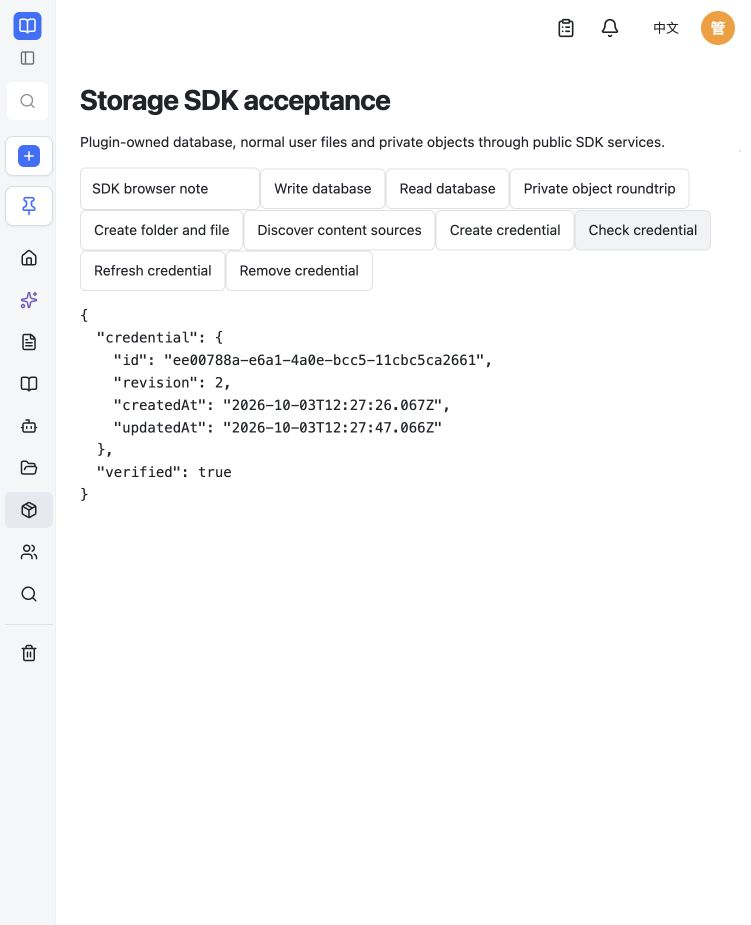
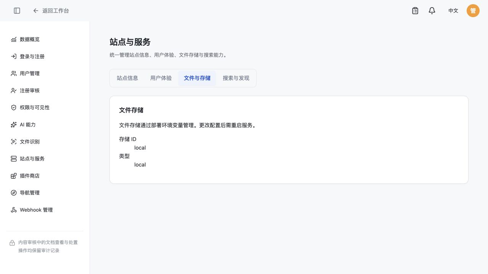

# 托管凭证与部署环境验收

2026-10-03，本地宿主源码 0.1.10 / SDK 源码 0.1.8，未发布本次版本。仅使用新建临时 SQLite 库、隔离 PostgreSQL schema、测试账号和合成凭证，原库和原配置未修改。

| 验收 | 结果 |
| --- | --- |
| `pnpm typecheck` | 通过 |
| `pnpm test` | 181 个文件通过，1182 项通过；3 项条件测试跳过 |
| PostgreSQL 定向组 | 凭证服务/实际插件生命周期/关系库与对象/存储与管理员接口/平台凭据，共 61 项通过 |
| Web 生产构建 | 通过；已有 Vite 配置、重复静态/动态导入和大包提示仍存在 |
| SDK 构建及独立消费者 | 通过；独立导入 storage.credentials.v1 的 JS 和声明，覆盖五个方法的类型调用 |
| 示例插件独立静态检查 | 通过；1.0.4、dataVersion 2、SDK ^0.1.8，无宿主源码依赖 |
| Compose 配置 | SQLite 与 PostgreSQL 环境映射通过；容器实际数据库、云存储 JSON 和主密钥与输入一致，含字面 `$` 的测试云密钥未改变 |
| 浏览器凭证流程 | 创建 revision 1，读取 verified=true，刷新 revision 2；进程重启后保持同 ID/revision 2、verified=true；删除后 credential=null |
| 管理员存储页面 | 只读展示存储 ID/provider，无后端及密钥输入、无保存操作；中英文说明与部署变量一致 |

凭证测试覆盖密文持久化、相似插件 ID 隔离、跨插件访问拒绝、并发 CAS、过期删除拒绝、UTF-8/Unicode/未知字段限制、认证绑定篡改、损坏数据不能覆盖、卸载事务回滚、旧句柄全部失效、重装代次、独立连接和密钥生命周期。实际插件启动覆盖无密钥的 required/optional 服务、不合法配置和错误密钥；插件 dispose 完成后宿主再销毁密钥。

浏览器截图：

S3 的 SDK 命令和条件提交使用测试适配器验证；本次未连接真实云账号。邮箱独立业务包和真实 SMTP/IMAP/OAuth 收发流程未在本次验收中运行，不能把宿主 SDK 凭证接口通过称为邮箱全部功能通过。邮箱侧应按[公开凭证接口](plugin-credentials.md)更新到 ^0.1.8 并独立联调。

按已确认的不兼容规则，credentials-v2 基线拒绝 0.1.9 的 storage-v1；没有补表、数据转换或迁移。没有执行 npm、DockerHub 或 GitHub 新版本发布。
