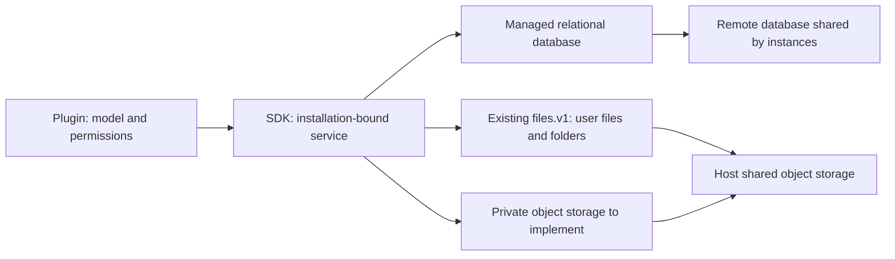

# Plugin horizontal scaling and managed storage contract

[中文](plugin-horizontal-scaling.zh-CN.md)

Status: approved contract, 2026-10-02; source host 0.1.8 / SDK 0.1.7, with no publication/production acceptance implied. All persistence is host-managed; plugins never distinguish local/remote backends. Package declaration checks and environment cleanup are implemented. Managed SQL/private objects are now exported; credentials/workspaces remain pending. No old business data was read, converted or deleted.

## Implemented storage revision (2026-10-03, SDK source 0.1.7)

`@smartdoca/plugin-sdk/storage` now exports installation-bound `pluginDatabaseToken` (`storage.sql.v1`) and `pluginObjectStorageToken` (`storage.objects.v1`). The database subset is explicit schema version 1, text/int32/double columns, primary/unique constraints, structured select/insert/update/remove and transactions with callbacks executed once. Joins, foreign keys, generic SQL, upsert, credentials and workspaces are not exported. Current SDK isolation is enforced by host-compiled queries over namespaced tables on the host connection; separate PostgreSQL roles/process isolation remain a stronger future boundary.

Logical databases use `plugin:<pluginId>`, user-file attribution and private objects use `plugins/<pluginId>`, and release ZIPs use `host/plugin-releases/<sha256>.zip`. Complete immutable ZIP bytes live in environment-configured file storage; the shared database holds registry version 2, archive references and trusted file-hash indexes. Verified cache hits do not download ZIPs again. All instances are restarted manually. The new host baseline rejects older databases/formats/SDK packages and preserves their data, with no migration or fallback. See [exact implementation and limitations](unified-storage-implementation.md).

## Current boundary and gaps

Before this change, guides assigned databases and business directories to plugins. That guidance is withdrawn; the [development guide](plugin-development.md) and [SDK contract](plugin-sdk-contract.md) now require host-managed persistence. The current structured database/private-object exports are listed above; `data.v1` and `data.v2` are not exported. Existing `files.v1` covers user files, folders, uploads, bindings, permissions and durable creation receipts.

An independently managed shared remote database can scale. The previous guidance also permitted instance-local durable business state without a common multi-instance contract, leaving every author to handle drivers, deployment, pools, backup and concurrency. Equal directory names do not mean shared data. SQLite WAL requires participating processes on the same host and does not work on network filesystems; a network directory is not a distributed database solution. See [SQLite's WAL documentation](https://www.sqlite.org/wal.html).

Pre-change audit findings (old storage guidance is superseded; historical acceptance applies only to its original versions):

| Location                                   | Finding                                                                                                                                        |
| ------------------------------------------ | ---------------------------------------------------------------------------------------------------------------------------------------------- |
| Development guide: business data directory | Shared business databases are described as using the same root, without distinguishing instance disks, shared filesystems and remote databases |
| SDK contract, sections 7 and 13            | Previously excluded generic SQL and assigned databases/directories to plugins; now requires managed storage with explicit implementation gaps  |
| Deployment: lifecycle and retention        | Says removal never deletes private data, contradicting its opening, the development guide and required uninstall cleanup                       |
| Architecture overview                      | Lists public `data`, which is not a current SDK export                                                                                         |
| `apps/server/src/plugins/manager.ts`       | Checks persisted `dataVersions`; removal calls `uninstall` before saving the registry; no proposed cluster drain/managed cleanup               |
| `packages/plugin-host/src/index.ts`        | Uses a temporary uninstall context; proposed storage injection cannot be assumed                                                               |

These old rules are not the new storage standard. Missing or nonconforming declarations fail without defaults/adapters; original packages and business data remain unmodified.

## Ownership

Plugins define business tables, indexes, authorization, job state and outbox. The host owns connections, physical isolation, durable files, credentials, backups and limits. The SDK exposes plugin-scoped services without private host database objects, drivers, connection strings or disk paths.

Every instance in a horizontal deployment uses the same managed database and object storage. Local disk holds rebuildable installation caches, disposable runtime caches and temporary work. Shared-storage failure is explicit, without automatic local persistence fallback.

## Managed SQL

The public logical namespace is `plugin:<pluginId>`, bound to the installed identity. The SDK exposes an injection-bound handle without a database-name selector. Bodies, query parameters and plugin-created contexts cannot select another identity/database.

Logical names need not be physical database names. Plugin IDs can contain dots; SQL identifiers have length/case rules. The host persists a collision-checked mapping and quotes identifiers rather than replacing punctuation or truncating IDs. The backend chooses databases, schemas or private files; plugins use their logical table names.

Name validation does not isolate arbitrary SQL. The managed service requires structured relational queries, schema definitions and transactions compiled by the host, without raw connections, unrestricted SQL, cross-database names, arbitrary functions or driver commands. PostgreSQL also requires restricted roles/schema privileges, denying host/other-plugin tables, server files, escalation and role changes. Prefixes, `search_path` and regular expressions alone are insufficient. See [PostgreSQL schemas and privileges](https://www.postgresql.org/docs/current/ddl-schemas.html) and [identifier rules](https://www.postgresql.org/docs/current/sql-syntax-lexical.html).

Plugins currently run in a trusted Node.js process. SDK boundaries are not a hostile-code sandbox; enforcing filesystem/environment isolation against malicious code requires process/OS isolation.

Hiding drivers does not make all PostgreSQL/SQLite/MySQL SQL interchangeable. Define a versioned, tested relational subset:

- Schema definitions, basic types, primary/unique/foreign keys and indexes. Initialize only an explicitly installed new database; validate existing structures without silently altering them.
- Parameterized select/insert/update/delete, same-database joins, paging, ordering, count and unique-key upsert. Validate values and identifiers separately.
- Atomic single-plugin transactions, conditional version updates and atomic counters for idempotency, claims and outbox. Handles retain connection/identity; callbacks contain no uploads or external side effects.
- Defined integer, boolean, UTC time, JSON, null, ordering and error semantics; result/query/transaction/connection limits and cancellation. Exact signatures/types/limits require an interface contract before implementation.
- Stable conflict/timeout/cancellation errors without driver leakage. Unknown commits do not automatically replay a business callback; check durable operation records first.

The host may use PostgreSQL for multiple instances and SQLite only for single-instance deployments/tests, both passing the same contract suite. These are host deployment choices; plugins never branch on driver or local/remote storage. Other drivers need acceptance before being declared supported. Dialect-specific features require explicit extensions, without silent degradation or driver-dependent plugin branches. These interface requirements imply no current SQL export and no old-database adapter.

The host handles pools, cancellation, monitoring and backups; plugins handle models, indexes and user permissions. Plugin isolation does not authorize users to read business rows. Physical colocation does not expose cross-plugin or host business transactions.

## Files and other functionality

Prohibit durable business state depending on system directories. Databases, uploads, permanent generated results, credentials, cursors and outbox cannot be directly persisted under program/installation directories, working directories, fixed `/tmp` paths or self-selected system directories. Preserve features through these entries:

| Content                                                                                                  | Host entry                                    | Requirements                                                                                                                                                                         |
| -------------------------------------------------------------------------------------------------------- | --------------------------------------------- | ------------------------------------------------------------------------------------------------------------------------------------------------------------------------------------ |
| User uploads, managed attachments, import originals and export deliverables                              | Existing `files.v1` files/folders             | Stable file IDs/bindings, user authorization, current quotas, upload checks and durable idempotency; no disk paths or permanent signed URLs                                          |
| Rows, config, jobs, event cursors, operation records and outbox                                          | Managed relational service to implement       | Plugin-ID isolation and shared visibility                                                                                                                                            |
| Private large binaries, durable intermediates and expensive internal indexes unsuitable for user folders | Private object storage to implement           | Host-bound identity, shared storage, limits, streams, opaque IDs, complete commit, validation, conditional writes/idempotency and controlled deletion; plugin business authorization |
| OAuth tokens and business secrets                                                                        | Host-managed credential capability to specify | Server-only, encrypted persistence, redaction and restrictions; no local credential files or browser-config exposure. No new public token is claimed                                 |
| Transcode/extraction/scanning/external-command work files                                                | Host-managed temporary workspace or streams   | Plugin/task isolation, size/time limits and crash cleanup; retry downloads/rebuilds inputs rather than requiring a previous instance's path                                          |
| Rebuildable caches                                                                                       | Memory or approved temporary cache            | Loss affects performance only; current authorization; never locks, idempotency or authoritative state                                                                                |
| Original external-system data                                                                            | Authorized remote APIs                        | Mail/sync/API integrations remain possible; durable copies/cursors/credentials/attachments follow the rows above                                                                     |

Private-object and temporary-workspace services do not exist yet. Do not claim `files.v1` covers all private blobs or disguise secrets as user files. Missing durable capabilities fail explicitly without filesystem fallback. Prefer streams/bytes when files are unnecessary.

Objects and relational data do not share a transaction. Persist intent, write objects, confirm metadata and recover by retry/compensation; garbage collection checks references and unfinished intents. Deliver user results by formal file-service registration/copy; private IDs are not public download credentials. Existing file permissions, receipts and reference protections are unchanged by the proposed direction.

## Multi-instance execution

Shared persistence is necessary but insufficient:

- Requests can reach any instance. Process services/registrations/connections remain isolated; memory is not global configuration/completion state.
- Database constraints enforce uniqueness; transactions/conditional versions coordinate writes. Local mutexes are not cluster locks.
- Claims use atomic updates, expiring leases and fencing/version conditions. Long jobs renew; expired owners cannot commit. Stable schedule keys deduplicate recurring tasks rather than each `ready` timer creating another task.
- External effects use durable outbox, stable operation IDs and remote idempotency. Timeouts may follow completion; no cross-service exactly-once promise. Cursors and handling facts commit together, with leases coordinating consumers.
- New-database initialization is coordinated; subsequent instances validate rather than concurrently alter structures. Existing mismatches fail; migrations require agreement.
- Local callbacks/WebSockets are not a cluster bus. Cross-instance invalidation/notification needs an explicitly provided shared host mechanism.
- Backups include database/object/user-file references and credentials. Restore checks structures/completeness and makes loss/rollback visible.

No mixed-SDK/mixed-schema rolling upgrade is promised. Drain traffic/work, switch together, validate and resume. Zero-downtime coexistence needs a separately accepted version/migration plan.

## Installation rejection and old data

Every package, including stateless plugins, declares `doca.storage: "host"` in package.json: all persistence depends on the host. Missing/other values fail without defaults, package conversion or old-directory/driver adapters. This check is independent of SDK range; conforming plugins using current public capabilities declare their real SDK requirements without inventing a new published SDK version.

`inspectPlugin` validates storage before server entry resolution/code import. Packing, ZIP/npm/store installs, offline directory discovery/import, shared-archive restoration and startup use that check. The declaration is a trusted author's commitment, not a Node.js sandbox or complete behavior audit. Relabeling a private-store plugin is nonconforming; review and independent acceptance check actual behavior.

| Object                                                            | Decision                                                                                                                            | Preservation, validation and rollback                                                                                                                                                                                                                     |
| ----------------------------------------------------------------- | ----------------------------------------------------------------------------------------------------------------------------------- | --------------------------------------------------------------------------------------------------------------------------------------------------------------------------------------------------------------------------------------------------------- |
| Nonconforming packages or missing/wrong declarations              | Refuse installation/loading without adapters                                                                                        | Retain original packages/archives/data. Rebuild compliant packages without substituting immutable same-version archives                                                                                                                                   |
| Old directories, external databases, credentials, jobs and outbox | No reads, automatic import, deletion or dual writes                                                                                 | Never substitute an empty managed store for installed data. Separately agree each plugin's structures/mappings/pending effects/validation/rollback                                                                                                        |
| Registry version 1 and old host baseline                          | Rejected without reads/conversion                                                                                                   | Preserve original database and archives; no migration or dual reads                                                                                                                                                                                       |
| dataVersion                                                       | Exact match; installed upgrades unchanged; mismatches fail without defaults or implicit upgrade/downgrade                           | Separately agree structure/backend conversion, never uninstall/delete to bypass migration; old matching markers do not establish new-store readability                                                                                                    |
| Existing files.v1 IDs, bindings, ACLs and receipts                | Existing formats/semantics; no private-object conversion or refactor deletion                                                       | Validate references, authorized downloads, receipts and object existence                                                                                                                                                                                  |
| Other old system-directory files                                  | Preserve without automatic scan/move                                                                                                | Agree destination services per plugin and check counts/sizes/hashes/authorization                                                                                                                                                                         |
| Disable/shutdown/dispose                                          | Release process resources, preserve persistence                                                                                     | Drain/unregister; authoritative state stays host-managed                                                                                                                                                                                                  |
| Explicit uninstall                                                | Plugin business unbinding/external revocation through public services; host owns managed private database/object/credential cleanup | Hook success commits registry removal, private generation fencing and durable object cleanup. Cluster task draining remains unimplemented. Partial failures imply neither success nor rollback; user files/other references are not automatically deleted |

No plugin business-data-directory environment variable is provided, including Compose/environment examples. `DOCA_PLUGINS_DIR` remains a rebuildable code/archive cache, never a business store. Local/remote database/object configuration belongs entirely to the host; SDK APIs do not expose it or require backend decisions.

Before any future conversion, back up and stop old writes, validate records/uniqueness/business rules/hashes/permissions. Before new writes, return to the original deployment if needed; after new writes, changing back to old directories loses data and reverse conversion/restore requires agreement. Rejecting old packages does not authorize deletion or migration.

## Status and acceptance

| Capability                                     | Current status                                                                                        | Required before delivery                                                                                |
| ---------------------------------------------- | ----------------------------------------------------------------------------------------------------- | ------------------------------------------------------------------------------------------------------- |
| User files/folders/attachments, `files.v1`     | Existing source interface                                                                             | Shared-backend multi-instance integration acceptance                                                    |
| Managed plugin-scoped relational storage       | Not exported/implemented                                                                              | Types, subset, identity/physical permissions, limits, errors, validation and independent SDK acceptance |
| Private objects                                | SDK 0.1.7 exports bounded immutable bytes                                                             | Streams, permissions, complete writes, conditional writes/idempotency, references, recovery and quotas  |
| Temporary workspace/managed plugin credentials | No public contract described here                                                                     | Lifecycle, isolation, cleanup, encryption and missing-service behavior                                  |
| Cluster claims                                 | Plugin responsibility; no generic public claim-service promise                                        | Lease expiry/takeover/fencing/duplicate execution on managed transactions                               |
| Storage declaration                            | Mandatory host declaration and pre-import rejection implemented across packages/directories/startup   | Declaration review and rejection-path acceptance                                                        |
| Old formats, schema checks, private uninstall  | Old baseline/registry rejected; schema identity checked; generation fenced and durable object cleanup | Cluster business-task draining remains pending                                                          |

Use isolated databases, independent plugins and test files. Two instances share database/object storage: write/upload on A, read on B; destroy A, rebuild on empty local disk and read again. Cover concurrent initialization/uniqueness, request replay, unknown commits, killed workers/takeover, stale-worker writes denied, storage failures without local fallback, cross-plugin database/object denial, business revocation, temporary cleanup and old-instance fencing against recreation/writes during uninstall.

The ban on self-managed durable databases/system-directory state is effective now, without exceptions for missing host capabilities. Plugins using existing host services may integrate; features requiring managed credential/workspace capabilities wait for delivery and acceptance instead of supplying private storage. Keep guides, SDK README and implementation status synchronized; never present unexported targets as runnable APIs.
