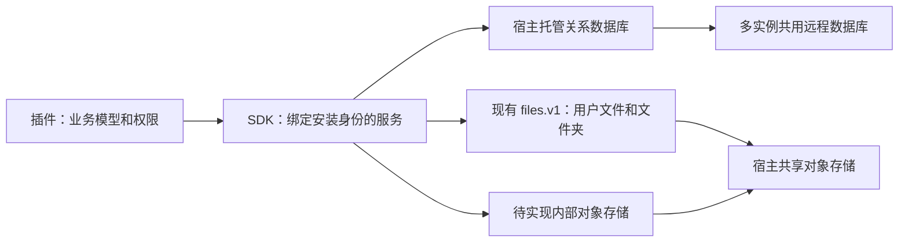

# 插件水平扩展与托管存储规范

[English](plugin-horizontal-scaling.md)

状态：2026-10-02 已确认规范。源码基线为宿主 0.1.10、SDK 0.1.8；不代表 npm 发布或生产验收。所有持久化依赖宿主，插件不感知本地/远端后端。包声明校验与环境配置清理已实现；托管 SQL 与内部对象已导出；凭证已在 SDK 源码 0.1.8 导出，临时工作服务尚未导出。本次没有读取、转换或删除旧业务数据。

## 已实现存储修订（2026-10-03，SDK 源码 0.1.7）

`@smartdoca/plugin-sdk/storage` 已导出安装身份绑定的 `pluginDatabaseToken`（`storage.sql.v1`）和 `pluginObjectStorageToken`（`storage.objects.v1`）。关系库支持显式 version 1 结构声明、text/int32/双精度列、主键/唯一约束、结构化查询/写入/删除，以及回调只执行一次的事务。SDK 源码 0.1.8 另导出 `pluginCredentialToken`（`storage.credentials.v1`），提供服务端加密凭证、元数据、修订号更新与删除。联表、外键、通用 SQL、upsert 和临时工作区尚未导出。见[凭证接口](plugin-credentials.md)。当前 SDK 通过宿主编译的查询和宿主连接中的命名空间表隔离；独立 PostgreSQL 角色与进程隔离是更强的待实现边界。

逻辑库为 `plugin:<pluginId>`，用户文件归属及私有对象使用 `plugins/<pluginId>`，发行包使用 `host/plugin-releases/<sha256>.zip`。ZIP 字节进入环境变量配置的文件存储，共享数据库只保存 version 2 清单、归档引用和可信文件哈希索引。有效缓存无需重新下载 ZIP。全部实例由运维逐个重启。新宿主基线拒绝旧数据库/格式/SDK 包，原数据保留，不提供迁移或 fallback。详见[准确实现与限制](unified-storage-implementation.md)。

## 现状与问题

改造前的开发规范和 SDK 契约要求插件自管数据库与业务数据目录；这条指引已撤销。当前[开发规范](plugin-development.zh-CN.md)和 [SDK 契约](plugin-sdk-contract.zh-CN.md)统一要求宿主托管。宿主没有公开 SQL、`data.v1`、`data.v2` 或插件内部对象存储服务。`files.v1` 已提供用户文件、文件夹、上传、附件绑定、权限和文件创建持久幂等。

插件自行连接同一个远程数据库，理论上也能扩展。原方案的问题是允许把业务持久状态放在实例目录，没有统一的多实例要求，插件作者需要分别处理驱动、部署、连接池、备份和并发。多个实例配置同一个目录名，不等于访问同一份数据。SQLite 的 WAL 要求访问数据库的进程位于同一主机，不能在网络文件系统上工作，不能把共享目录作为分布式数据库方案。见 [SQLite 官方 WAL 说明](https://www.sqlite.org/wal.html)。

改造前的审计记录（旧存储指引现已替换，历史验收仅适用于当时版本）：

| 位置                                 | 核对结果                                                                                                          |
| ------------------------------------ | ----------------------------------------------------------------------------------------------------------------- |
| 开发规范「业务数据目录」             | 将共用业务库描述成使用同一根目录，没有区分实例磁盘、共享文件系统与远程数据库                                      |
| SDK 契约第 7、13 节                  | 明确不提供通用插件 SQL，插件自管数据库与目录；现已改为宿主托管并列明实现缺口                                      |
| 部署说明「生命周期与保留」           | 英文写移除不删除私有业务数据，与同文开头、开发规范及当前卸载清理要求矛盾                                          |
| 插件架构概览                         | 列出公开 `data` 服务，当前 SDK 并无此导出                                                                         |
| `apps/server/src/plugins/manager.ts` | 校验持久 `dataVersions`，结构号不同拒绝；移除先调用 `uninstall`，再保存清单；托管私有库、对象与凭证清理已实现，集群业务任务排空尚未实现 |
| `packages/plugin-host/src/index.ts`  | 卸载使用临时生命周期上下文，不能假定待实现的存储服务已可注入                                                      |

这些旧规则不作为新插件的存储标准。缺失或不符合新声明的包直接拒绝，不补默认值或适配；旧包与旧业务数据不删除、不转换。

## 职责

插件继续定义业务表、索引、授权、任务状态和 outbox；宿主统一管理数据库连接、物理隔离、持久文件、凭证、备份和资源限制。SDK 提供公开的插件作用域服务，不提供宿主私有数据库对象、驱动、连接串或磁盘路径。

水平扩展部署要求所有实例访问相同的托管数据库和对象存储，实例磁盘只保存可重建的安装缓存、可丢弃的运行缓存和临时文件。共享存储失败时明确报错，不自动切换成本地持久存储。

## 托管 SQL 服务

对插件公开的是绑定安装身份的逻辑库，命名空间为 `plugin:<pluginId>`。SDK 只暴露注入时绑定的句柄，不提供可选择库名的参数。HTTP body、查询参数和插件自行构造的上下文不能决定身份，也不能打开其他插件的库。

逻辑库名不必是物理数据库名。插件 ID 可含点号，数据库标识符还有长度和大小写规则；宿主持久登记无冲突的映射并正确引用标识符，不能简单替换符号或截断。数据库、schema 或物理文件的位置由宿主选择，插件只使用自己的逻辑表名。

仅限制库名不能隔离任意 SQL。托管关系服务提供受限的关系查询、建表定义和事务 API，由宿主编译成 SQL，不暴露原始连接、任意 SQL 字符串、跨库表名、任意函数或驱动命令。PostgreSQL 还应使用受限角色和 schema 权限，禁止访问宿主表、其他插件表及服务器文件，禁止提权和改变角色。不能仅靠表名前缀、`search_path` 或正则过滤；schema 本身不是权限隔离。见 [PostgreSQL schema 与权限说明](https://www.postgresql.org/docs/current/ddl-schemas.html)和[标识符规则](https://www.postgresql.org/docs/current/sql-syntax-lexical.html)。

插件当前运行于受信任的 Node.js 进程。这些规则约束 SDK 访问，不构成恶意代码沙箱。真正限制恶意插件访问进程文件或环境，需要单独的进程与操作系统隔离。

隐藏驱动不等于任意 PostgreSQL、SQLite、MySQL SQL 都能无差别运行。接口须公开一个版本化、可测试的关系能力子集：

- 表定义、基本类型、主键、唯一约束、外键和索引。初始化只建立显式首次安装的新库，已有库先校验结构，不借初始化偷偷改旧结构。
- 参数化查询、插入、更新、删除、同库 join、分页、排序、计数和基于唯一键的 upsert；值和标识符分别校验，不拼接用户输入。
- 同插件库内的原子事务、带版本条件的更新和原子计数，支持幂等回执、任务领取及 outbox。事务句柄固定连接和身份，回调不能包含文件上传或外部副作用。
- 定义整数范围、布尔、UTC 时间、JSON、空值、排序和错误语义；限制单次结果、查询与事务时长、总连接数，支持取消。类型、签名和具体数值在实现前补充契约。
- 返回稳定的唯一冲突、版本冲突、超时和取消错误，不暴露驱动错误。提交结果未知时不能自动重试业务回调，应先查持久幂等记录。

宿主可用 PostgreSQL 支撑多实例，SQLite 限于单实例和隔离测试，两者须运行同一契约测试；这些是宿主部署选择，不暴露给插件，插件不按驱动或本地/远端分支。其他驱动通过能力验收后才宣称支持。方言特有功能需要显式扩展，不能静默降级、假装成功或要求插件按驱动分支。这是托管接口要求，SQL 子集已导出，也不是旧数据库格式适配。

宿主负责连接池、取消、监控和备份，插件负责业务模型、索引和用户权限。插件库隔离不等于用户权限：业务入口仍须检查当前用户对记录的授权。即使物理上共用 PostgreSQL，也不开放跨插件或宿主业务事务。

## 文件存储与其他功能

应杜绝依赖系统目录的持久业务状态。数据库、用户上传、永久生成结果、凭证、任务游标和 outbox，不能直接写入程序目录、安装目录、工作目录、固定 `/tmp` 路径或插件自行选择的系统目录。正常功能使用以下入口：

| 内容                                                                   | 建议入口                        | 要求                                                                                                                   |
| ---------------------------------------------------------------------- | ------------------------------- | ---------------------------------------------------------------------------------------------------------------------- |
| 用户上传、用户管理的附件、导入原件、导出成品                           | 现有 `files.v1` 文件/文件夹系统 | 稳定文件 ID 与业务绑定，遵循用户权限、当前配额、上传检查和持久幂等；不保存绝对路径或永久使用签名 URL                   |
| 表记录、配置、任务状态、事件游标、幂等记录和 outbox                    | 待实现托管关系数据库            | 插件 ID 隔离，多实例共同可见                                                                                           |
| 不应展示到用户文件夹的内部大二进制、持久中间产物、重建成本高的内部索引 | 待实现插件内部对象存储          | 宿主绑定身份、共享存储和资源限制；流式读写、稳定不透明 ID、完整提交、校验、条件写/幂等及受控删除；业务授权仍由插件检查 |
| OAuth token、业务密钥等凭证                                            | `pluginCredentialToken`，SDK 源码 0.1.8        | 服务端使用、加密持久化、脱敏和限制访问；不写本地凭证文件、不下发普通浏览器配置；身份与安装代次由宿主绑定，见[凭证接口](plugin-credentials.md)         |
| 转码、解压、扫描或第三方命令必需的工作文件                             | 宿主管理的临时工作目录或流      | 按插件/任务隔离、限制大小与时长、清理崩溃遗留；重试重新下载或重建，不依赖前一实例的临时路径                            |
| 可重建缓存                                                             | 内存或宿主允许的临时缓存        | 丢失只影响性能，命中后仍做当前授权；不承担锁、幂等或唯一事实                                                           |
| 外部业务系统的原始数据                                                 | 经授权的远端 API                | 不阻止邮件、同步等对外连接；持久副本、游标、凭证和附件遵循上列入口                                                     |

内部对象存储已在 SDK 0.1.7 公开，临时目录服务尚未公开。不能假称 `files.v1` 已提供所有内部 blob 场景，也不能将凭证伪装成用户文件。缺失持久能力时明确报告功能不可用，不回退系统目录。不需要本地文件的处理优先传流或字节数据。

内部对象与关系数据库仍不是共同事务。先记录持久意图、写对象、确认元数据，失败通过重试/补偿恢复；垃圾回收检查引用和未完成意图。将结果交给用户时经文件服务正式登记或复制，不将内部对象 ID 变成公开下载凭据。不改变既有文件权限、幂等回执和引用保护。

## 多实例运行规则

统一存储只解决持久事实，还必须做到：

- 请求可路由到任意实例；服务、注册和连接仍按进程隔离，内存变量不是全局配置或完成状态。
- 业务唯一性由数据库约束保证；更新用事务或版本条件，进程内 mutex 不能作为集群锁。
- 任务使用原子领取、到期租约和 fencing/version。长任务续租，失去租约的执行者不能提交新状态。周期任务用稳定调度键去重，不能每个 `ready` 定时器各建一份任务。
- 外部副作用用持久 outbox、稳定业务操作 ID 和远端幂等能力处理；超时可能已完成，不承诺跨服务 exactly-once。事件游标和处理事实在本插件事务里提交，多消费者通过共享租约协调。
- 首次建库与初始化也需数据库协调，第二个实例验证结构而不是并行改表；已有结构不同拒绝，迁移须另行确认。
- WebSocket/本地回调不承担全局总线；跨实例失效或通知依赖宿主明确提供的共享机制，不能把现有进程内广播解释成集群广播。
- 备份覆盖数据库、内部对象、用户文件引用及凭证；恢复验证结构与对象完整性，任何数据回退或丢失必须可见。

本方案不承诺混合 SDK、混合结构版本的滚动升级。先停流、排空，统一切换并验证后恢复；不停机升级需要另行接受版本共存与迁移方案。

## 安装拒绝与旧数据边界

所有安装包（包括无独立状态的插件）必须在 package.json 声明 `doca.storage: "host"`，其含义是持久化完全依赖宿主。字段缺失或任何其他值直接拒绝，不自动补字段、不转换旧包、不提供旧目录/驱动适配。此声明独立于 SDK range，使用当前已实现公共服务的合规插件可继续声明其真实 SDK 要求，不虚构新 SDK 发布版本。

`inspectPlugin` 在解析服务端入口与导入代码前检查声明；打包、ZIP/npm/商店安装、离线目录发现/导入、共享归档恢复和启动均使用该入口。声明是受信任作者的契约承诺，不是对任意 Node.js 代码的沙箱或完整行为审计。不能仅补声明而继续使用私有存储，审核与独立验收须核对真实行为。

| 对象                                            | 处理决定                                                                    | 保存、验证和回退                                                                                                                             |
| ----------------------------------------------- | --------------------------------------------------------------------------- | -------------------------------------------------------------------------------------------------------------------------------------------- |
| 不符合宿主托管规范、缺失/错误声明的包           | 拒绝安装和加载，无兼容适配                                                  | 原包和归档保留，拒绝不删除数据；新合规包需重新构建发布，不能同版本偷偷改归档                                                                 |
| 原自管数据目录、外部业务库、凭证、任务和 outbox | 不读取、不自动导入、不删除、不双读双写                                      | 已有数据不能被新空库覆盖；逐插件转换须另交源/目标结构、映射、未完成副作用、校验和回退，经确认后执行                                          |
| 旧宿主基线与 version 1 清单                     | 拒绝读取/转换                                                               | 保留原数据库和归档，不迁移、不双读                                                                                                           |
| `doca.dataVersion`                              | 精确匹配；已安装升级不变，实际结构不同拒绝，无隐式升降级或默认字段          | 结构/后端转换另行确认，不用卸载删库绕过迁移；旧标记相同不证明新库可读                                                                        |
| 现有 files.v1 文件 ID、绑定、权限和回执         | 保持既有格式与语义，不转换为内部对象、不因业务库改造删除                    | 验证引用、下载权限、回执和对象存在性                                                                                                         |
| 系统目录内其他旧持久文件                        | 保持原样，不自动扫描移动                                                    | 未来按插件确认目标服务，校验数量、大小、哈希及授权                                                                                           |
| 禁用、停机、dispose                             | 只回收进程资源，不删持久数据                                                | 注册/任务排空，业务状态仍由宿主管理                                                                                                          |
| 显式卸载                                        | 插件用公共服务处理业务解绑/外部撤销；宿主负责托管私有库、内部对象和凭证清理 | 私有库/对象卸载在清单事务中执行 generation 隔离与持久化对象清理；业务任务集群排空仍未实现，所有实例需人工重启。部分清理失败不得假称回滚/成功；用户文件及其他引用不自动删除。 |

不再提供插件业务数据目录环境变量，Compose 和环境配置示例不再传入它。安装缓存 `DOCA_PLUGINS_DIR` 保留，仅存可重建代码归档与解压结果，不能承载持久业务数据。数据库/对象存储的本地或远端配置完全归宿主，SDK 不返回这些配置或要求插件判断后端。

若未来转换旧数据，切换前备份并停止旧写入，验证记录数、唯一约束、业务规则、文件/对象哈希和权限。新部署尚未接收写入时可回到原部署；接收新写入后不能简单改回旧目录，反向转换或备份恢复需要单独确认。拒绝旧包不构成删除或迁移授权。

## 实现状态与验收

| 能力                             | 当前状态                                                       | 交付前要求                                                                      |
| -------------------------------- | -------------------------------------------------------------- | ------------------------------------------------------------------------------- |
| 用户文件/文件夹与附件 `files.v1` | 已有源码接口                                                   | 共享后端的多实例集成验收                                                        |
| 插件作用域托管关系数据库         | SDK 0.1.7 已导出结构化事务/结构声明                            | 类型、能力子集、身份校验、物理权限、限制、错误语义和结构校验；独立 SDK 消费验收 |
| 插件内部对象存储                 | SDK 0.1.7 已导出有界不可变对象                                 | 流式读写、权限、完整提交、幂等/条件写、引用保护、恢复和配额验收                 |
| 托管插件凭证 | SDK 源码 0.1.8 已实现加密 CRUD、元数据、版本 CAS 和卸载失效 | 隔离 SQLite/PostgreSQL 与独立 SDK 验收，见[凭证接口](plugin-credentials.md) |
| 临时目录 | 未导出 | 生命周期、隔离、限制和清理 |
| 跨实例业务任务领取               | 插件负责，没有通用公开领取服务承诺                             | 在托管事务能力上验证租约、过期接管、fencing 与重复执行                          |
| 存储声明                         | 已实现必填 host 与导入代码前拒绝；包/目录/启动统一校验         | 声明真实性审核和拒绝路径验收                                                    |
| 旧格式、结构校验与私有存储卸载   | 拒绝旧基线/清单，检查结构声明，generation 隔离并持久化清理对象 | 业务任务集群排空仍待实现                                                        |

验收使用隔离数据库、独立插件和测试文件。至少两个实例共用数据库和对象存储，在 A 上传/写入、B 读取；销毁 A，以空本地磁盘重建后仍能读取。还需覆盖同时首次初始化、并发唯一性、重复请求、提交响应丢失、任务进程被杀与过期接管、重叠租约下旧执行者写入被拒绝、存储故障无本地回退、跨插件库/对象拒绝、业务撤权、临时目录清理和卸载时旧实例不能重建/写入数据。

禁止自建持久库和系统目录存储的规范立即生效，不为缺失宿主能力提供例外。当前使用已实现宿主服务的插件可以接入；需要临时工作区的新功能等待对应能力实现与验收，不以私有存储替代。规范、SDK README 和实现状态表须持续同步，不将尚未导出的接口写成可运行示例。
